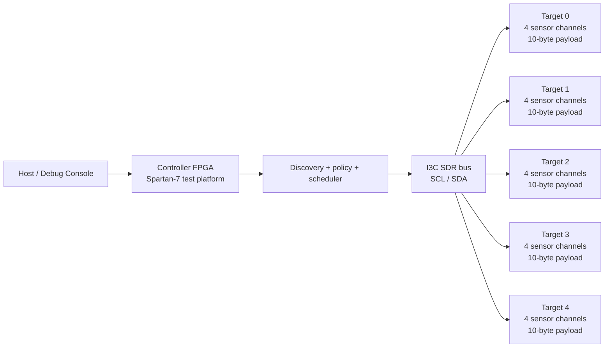

# I3C Distributed Sensor Control Baseline

This repository is the RTL, verification, FPGA demo, and software-control baseline for a closed-system I3C controller platform.

## Current Flagship Demo

The most useful top-level image on this branch is:

- [rtl/fpga_test/spartan7_i3c_dual_target_lab_top.v](/Users/jhaas/Development/Digital_Design/rtl/fpga_test/spartan7_i3c_dual_target_lab_top.v)

That CMOD S7 demo contains:

- 1 internal I3C controller
- 2 identical internal I3C targets
- deterministic target signatures readable through the controller
- 10-byte sensor-style payload windows per target
- one writable control register per target that drives a visible LED/output
- UART command transport
- Python client, FastAPI backend, and Next.js dashboard scaffolding

If you want the shortest path to “program FPGA, inspect target A/B, read payloads, and toggle outputs,” this is the path to use.

## What This Branch Is Good At

This branch is already strong in the practical subset that matters for a closed manufactured system:

- robust single-controller SDR transactions
- known-target bring-up with direct CCC boot
- predictable scheduled polling/service
- targeted reset/recovery for misbehaving endpoints
- narrow fault-diagnostic IBI policy handling
- interactive FPGA validation with host-visible reads and writes

It is not claiming full spec closure across every advanced I3C family. It is claiming a serious controller baseline that now has an interactive hardware demo instead of just a pile of simulations and good intentions.

## Dual-Target Lab System

The dual-target lab configuration is:

- 1 controller plus 2 internal targets
- static target addresses `0x30` and `0x31`
- controller-assigned dynamic addresses `0x10` and `0x11`
- deterministic target signatures at register window `0x00..0x03`
- writable target output/LED control register at `0x04`
- 10-byte sensor payload window at `0x10..0x19`
- equal-rate background polling plus host-triggered direct reads/writes

## Larger Reference System

The broader repo still includes the larger five-target reference configuration:

- 1 controller plus 5 sensor endpoints
- static-assisted boot for the FPGA validation stack
  static target addresses `0x30`..`0x34`
  controller-assigned dynamic addresses `0x10`..`0x14`
- identical endpoint service policy with equal-rate polling
- 4 parallel sampled sensor channels per endpoint
- 10-byte payload per endpoint service
  8 bytes for four 16-bit sensor samples
  1 byte for temperature
  1 byte for misc/status
- endpoint configuration target of 2 kS/s effective sampling per endpoint
- controller-side selector template `0x40` before each scheduled read

## Example System



Example-system behavior in the current repo:

- controller uses on-bus `SETDASA` to assign active dynamic addresses to 5 targets
- controller configures identical service shape for all 5 endpoints
- each service cycle writes selector `0x40`
- each readback returns 10 bytes per endpoint
- bytes are modeled as four 16-bit sensor samples plus temperature and misc/status
- scheduler polls all 5 endpoints at the same configured cadence

## FPGA Validation Stack

The FPGA-test implementation is kept separate from the core protocol RTL in:

- [rtl/fpga_test/i3c_demo_rate_tick.v](/Users/jhaas/Development/Digital_Design/rtl/fpga_test/i3c_demo_rate_tick.v)
- [rtl/fpga_test/i3c_sensor_frame_gen.v](/Users/jhaas/Development/Digital_Design/rtl/fpga_test/i3c_sensor_frame_gen.v)
- [rtl/fpga_test/i3c_sensor_target_demo.v](/Users/jhaas/Development/Digital_Design/rtl/fpga_test/i3c_sensor_target_demo.v)
- [rtl/fpga_test/i3c_sensor_controller_demo.v](/Users/jhaas/Development/Digital_Design/rtl/fpga_test/i3c_sensor_controller_demo.v)
- [rtl/fpga_test/spartan7_i3c_controller_demo_top.v](/Users/jhaas/Development/Digital_Design/rtl/fpga_test/spartan7_i3c_controller_demo_top.v)
- [rtl/fpga_test/spartan7_i3c_target_demo_top.v](/Users/jhaas/Development/Digital_Design/rtl/fpga_test/spartan7_i3c_target_demo_top.v)

Those files implement:

- deterministic, time-varying synthetic sensor frames on each target
- target-side signatures that encode endpoint identity and frame progression
- controller-side static-assisted bus bring-up using direct CCC `SETDASA`
- controller-side capture buffers exposing the latest payload per endpoint to higher-level logic
- board-facing Spartan-7 wrappers for controller-side and target-side FPGA prototype use

## Spartan-7 Test Role

Spartan-7 is the hardware validation platform, not the project identity.

In the example hardware flow:

- [rtl/spartan7_i3c_top.v](/Users/jhaas/Development/Digital_Design/rtl/spartan7_i3c_top.v) provides the board-facing controller wrapper
- [constraints/spartan7_i3c_demo.xdc](/Users/jhaas/Development/Digital_Design/constraints/spartan7_i3c_demo.xdc) maps the physical pins
- the controller-side protocol, policy, scheduler, and transaction logic are exercised on FPGA
- the 5-target system itself is currently modeled in simulation by [tb/tb_i3c_five_target_sampling_system.v](/Users/jhaas/Development/Digital_Design/tb/tb_i3c_five_target_sampling_system.v)
- this lets the repo separate “real controller hardware timing” from “still-evolving target application logic”

The repository therefore serves three linked purposes:

1. define the controller/target architecture for the full distributed sensor system
2. provide executable RTL and regression tests for the bus-management features being implemented phase by phase
3. use Spartan-7 only as a practical hardware validation platform for SDR bring-up and signal-level verification

## Protocol Status

This is the fastest map of what each I3C feature does in this system and how far the repo has gotten with it.

| Feature / Command | Purpose in the System | Status | Used in FPGA test system | Current repo baseline |
| --- | --- | --- | --- | --- |
| SDR private read/write | Normal controller-to-target telemetry and configuration traffic once addressing is stable. | Implemented | Yes | Controller and target transport path is regression-backed. |
| Broadcast CCC `RSTDAA` | Clear dynamic addresses so the controller can recover or restart discovery from a known state. | Implemented | Not required in current fixed demo flow | Target address-state reset is wired and tested. |
| Broadcast CCC `SETAASA` | Let a target use its static address as the active dynamic address during static-assisted boot. | Implemented | No | Static-assisted address activation is wired and tested. |
| Direct CCC framing | Required controller transaction shape for target-specific CCC commands that use repeated start. | Implemented | Yes | Controller-side direct write/read framing is in place. |
| Direct CCC `SETDASA` | Assign a chosen dynamic address to a specific target that can still be reached by static address. | Implemented | Yes | Target-side decode updates the active dynamic address and suppresses normal transport during the command. |
| Direct CCC `GETPID` | Read a target provisional ID so the controller can identify it before or alongside address policy. | Implemented | No | Target returns PID through the direct CCC read path. |
| Direct CCC `GETBCR` / `GETDCR` | Read capability/class metadata over direct CCC instead of relying only on discovery-time capture. | Implemented | No | Target returns BCR and DCR through dedicated direct CCC read regressions. |
| Direct CCC `GETSTATUS` | Read current target status so controller policy can observe address/policy/reset-related state. | Implemented | No | Target returns a compact 16-bit status word and regression covers direct readback. |
| Direct CCC `RSTACT` | Program target reset action policy so later recovery flows have an explicit target-side action selection. | Implemented | No | Direct write path updates target reset-action state and is mirrored into controller policy tracking. |
| `ENTDAA` single-target baseline | Discover one unassigned target, capture identity fields, and assign a dynamic address. | Implemented | No | PID/BCR/DCR capture plus controller-side assignment is regression-backed. |
| `ENTDAA` multi-target sequencing | Enumerate multiple unassigned targets in deterministic PID order and assign addresses across repeated discovery passes. | Implemented | Available, but not exercised by the FPGA test stack | Two-target and six-target regressions cover arbitration ordering, BCR/DCR inventory retention, repeated assignment, full-table population, and exhaustion/NACK behavior. |
| Event-control CCCs `ENEC` / `DISEC` | Enable or disable target-side event classes so future IBI/event policy has explicit controller ownership. | Implemented | No | Broadcast and direct event-mask updates are wired into target state and regression-backed. |
| Length / capability CCCs `SETNEWDA`, `SETMWL`, `SETMRL`, `GETMWL`, `GETMRL`, `GETMXDS`, `GETCAPS` | Let the controller retarget a dynamic address and negotiate/report practical transfer limits and capabilities without relying on hard-coded assumptions. | Implemented | No | Wave 1 branch baseline is regression-backed and keeps max read/write length plus capability bytes in target-side CCC state. |
| Activity / group CCCs `ENTAS0..3`, `SETGRPA`, `RSTGRPA` | Let the controller place targets into explicit activity states and control group-address membership for shared directed transactions. | Implemented | No | Wave 3 branch baseline stores target activity state, assigns and clears group addresses, and proves real group-address private transfers in regression. |
| Known-target bring-up manager | Boot a fixed manufactured system by assigning dynamic addresses, verifying target identity and metadata over the bus, and programming service policy deterministically instead of relying on hopeful discovery folklore. | Implemented | No | `rtl/i3c_known_target_hub.v` now performs `SETDASA`, `GETPID`, `GETBCR`, `GETDCR`, `GETSTATUS`, `RSTACT`, and `ENEC` during boot before handing the bus to scheduled service. |
| Broader CCC subset | Add additional management commands for policy, status, and recovery. | In Progress | Partially available but not used in the example service loop | Repo now covers `RSTDAA`, `SETAASA`, `SETDASA`, `GETPID`, `GETBCR`, `GETDCR`, `GETSTATUS`, `RSTACT`, `ENEC`, `DISEC`, and `ENTDAA`, including recovery/status regressions across reset-related address-state transitions. |
| Controller endpoint policy state | Turn discovered endpoints into a managed inventory with per-target policy, class, cadence, service history, and health state. | In Progress | Yes | DAA now auto-populates policy records with PID/BCR/DCR, derived class, enable state, event-mask, reset-action, status, service period, due state, service length, selector, last service tag, success/error counters, and recovery sequencing state. |
| Per-endpoint cadence and service statistics | Let the controller schedule each endpoint at a useful rate and retain enough history to make real policy decisions. | Implemented | Yes | Controller policy now tracks service period, due-now eligibility, service length, selector, service count, success count, error count, consecutive failures, and last service tag per endpoint. |
| Scheduler-driven multi-endpoint service | Poll and service known targets deterministically once the address map is stable. | In Progress | Yes | A cadence-aware round-robin scheduler now walks integrated policy state, issues configured selector-write plus scheduled-read templates, performs per-endpoint multi-byte reads, skips disabled or faulted endpoints, and captures success/NACK results. |
| Reset and recovery policy | Escalate from transaction failures or stale bus state into targeted recovery instead of blind reboot behavior. | Implemented for the known-target hub subset | No | `rtl/i3c_known_target_hub.v` now disables a failing endpoint, probes it with `GETSTATUS`, reissues `SETDASA` on the known static address when needed, validates status, and re-enables service without disturbing the rest of the bus. |
| In-band interrupts (IBI) | Allow rare urgent target-originated events without turning routine traffic into asynchronous chaos. | In Progress | No | Full on-bus IBI is still deferred, but the repo now has a narrow fault-diagnostic IBI policy hook in `rtl/i3c_known_target_hub.v` that only responds to explicit fault requests from enabled endpoints and immediately drives targeted status/recovery handling. |
| HDR modes | Higher-performance optional transfer modes beyond current SDR scope. | Future | No | Explicitly out of current project scope. |

## Current Code and Planning Artifacts

- `rtl/i3c_bus_engine.v`: Low-level SDR bus engine for START/STOP, byte transfer, and ACK/NACK handling.
- `rtl/i3c_ctrl_txn_layer.v`: Transaction layer wrapper above the bus engine.
- `rtl/i3c_sdr_controller.v`: Compatibility wrapper preserving the original simple controller interface.
- `rtl/i3c_ctrl_ccc.v`: Broadcast CCC issue path built on the transaction layer.
- `rtl/i3c_ctrl_direct_ccc.v`: Controller-side direct CCC framing engine with repeated-start support for direct write/read command flows.
- `rtl/i3c_ctrl_entdaa.v`: Controller-side `ENTDAA` sequencer baseline for PID/BCR/DCR capture and dynamic-address assignment.
- `rtl/i3c_ctrl_daa.v`: Controller-side dynamic-address assignment and endpoint-inventory state for PID/BCR/DCR retention.
- `rtl/i3c_ctrl_inventory.v`: Controller-side bridge that feeds DAA discovery results directly into endpoint policy state.
- `rtl/i3c_ctrl_policy.v`: Controller-side endpoint policy table for per-address class, enable, cadence, event-mask, reset-action, status, health, service statistics, per-endpoint service length/selector configuration, and reset-action-keyed recovery sequencing.
- `rtl/i3c_ctrl_scheduler.v`: Cadence-aware round-robin scheduler that scans policy state and emits service requests only for enabled, healthy, due endpoints.
- `rtl/i3c_ctrl_top.v`: Controller integration wrapper that connects inventory, scheduler, and transaction issue into real scheduled selector-write plus multi-byte read service templates.
- `rtl/i3c_known_target_hub.v`: System-oriented single-controller SDR hub wrapper for fixed known targets, including verified direct-CCC boot, deterministic service setup, targeted `SETDASA`-based recovery, and a narrow fault-diagnostic IBI policy hook.
- `rtl/i3c_target_transport.v`: Synthesizable SDR target transport block.
- `rtl/i3c_target_ccc.v`: Target-side CCC decode block for event-control, status/reset, metadata, addressing CCCs, and `ENTDAA` participation with arbitration handling.
- `rtl/i3c_target_daa.v`: Target-side dynamic-address state block.
- `rtl/i3c_target_top.v`: Target integration wrapper joining transport, DAA state, CCC decode, and a latched register-selector shell for scheduled write templates.
- `rtl/spartan7_i3c_top.v`: Original minimal top-level wrapper for Spartan-7 SDR bring-up.
- `rtl/fpga_test/i3c_demo_rate_tick.v`: Generic tick divider used by FPGA-test controller and target demo wrappers.
- `rtl/fpga_test/i3c_sensor_frame_gen.v`: Deterministic target-side sample/signature generator for FPGA validation.
- `rtl/fpga_test/i3c_sensor_gpio_target_demo.v`: Dual-target lab wrapper with a small register map, writable LED-control register, signature bytes, and sensor-payload window.
- `rtl/fpga_test/i3c_sensor_target_demo.v`: Target demo wrapper that combines the frame generator with the existing target transport/CCC shell.
- `rtl/fpga_test/i3c_sensor_controller_demo.v`: Controller demo wrapper that performs static-assisted `SETDASA` boot, configures all 5 endpoints, and captures payloads into controller-side buffers.
- `rtl/fpga_test/i3c_dual_target_lab_controller.v`: Two-target known-device controller wrapper for the CMOD lab system, including direct-CCC boot, periodic polling, host-triggered private reads/writes, and targeted `GETSTATUS`/`SETDASA` recovery.
- `rtl/fpga_test/spartan7_i3c_controller_demo_top.v`: Spartan-7 controller wrapper for the FPGA-validation stack.
- `rtl/fpga_test/spartan7_i3c_dual_target_lab_top.v`: Dedicated CMOD S7 top for the dual-target UART-controlled lab demo.
- `rtl/fpga_test/spartan7_i3c_target_demo_top.v`: Spartan-7 target wrapper for the FPGA-validation stack.
- `rtl/fpga_test/spartan7_i3c_unified_demo_top.v`: Unified single-board demo: controller + 5 internal targets + UART command interface.
- `rtl/uart_tx.v`: 8N1 UART transmitter (115200 baud, 100 MHz clock).
- `rtl/uart_rx.v`: 8N1 UART receiver with double-flop synchronizer.
- `rtl/uart_cmd_handler.v`: UART command state machine for demo control (start/read/status).
- `rtl/uart_dual_target_lab_cmd_handler.v`: Binary UART request/response bridge for target A/B summary, register reads, and register writes.
- `tools/uart_interface.py`: Python pyserial host tool for UART command interface.
- `tools/dual_target_lab_client.py`: Python UART client for the dual-target CMOD lab demo.
- `software/dual_target_lab_backend/app.py`: FastAPI backend exposing the dual-target lab controller over HTTP.
- `software/dual_target_lab_frontend/app/page.tsx`: Next.js dashboard for target A/B status, payloads, and LED control.
- `tb/i3c_target_model.v`: Simple behavioral target model for simulation.
- `tb/tb_i3c_sdr_controller.v`: Happy-path testbench that runs one write + one read transaction.
- `tb/tb_i3c_sdr_nack.v`: Negative-path testbench that verifies address-miss NACK handling.
- `tb/tb_i3c_target_transport.v`: Regression using the synthesizable target transport in `rtl/`.
- `tb/tb_i3c_daa_state.v`: Regression for controller/target dynamic-address state handling.
- `tb/tb_i3c_broadcast_ccc.v`: Regression for broadcast CCC handling (`RSTDAA`, `SETAASA`).
- `tb/tb_i3c_direct_ccc_write.v`: Regression for controller-side direct CCC write framing with repeated start.
- `tb/tb_i3c_direct_ccc_read.v`: Regression for controller-side direct CCC read framing and response capture.
- `tb/tb_i3c_setdasa.v`: Integration regression for target-side direct CCC decode and `SETDASA` dynamic-address assignment.
- `tb/tb_i3c_getpid.v`: Integration regression for target-side `GETPID` readback.
- `tb/tb_i3c_getbcrdcr.v`: Integration regression for direct CCC `GETBCR` and `GETDCR` readback.
- `tb/tb_i3c_getstatus.v`: Integration regression for direct CCC `GETSTATUS` readback.
- `tb/tb_i3c_entdaa.v`: First real controller/target `ENTDAA` regression with automatic controller inventory/policy population.
- `tb/tb_i3c_entdaa_multi.v`: Multi-target `ENTDAA` regression covering ordering, repeated assignment, automatic policy population, and exhaustion/NACK behavior.
- `tb/tb_i3c_entdaa_stress.v`: Six-target `ENTDAA` stress regression covering PID ordering, BCR/DCR inventory capture, automatic policy population, exact-fit table population, and exhaustion/NACK behavior.
- `tb/tb_i3c_scheduler.v`: Scheduler regression proving cadence-aware round-robin service selection from policy state, including service-period gating, repeated-failure fault latching, recovery clear, skip-on-disable, and skip-on-fault behavior.
- `tb/tb_i3c_ctrl_top_service.v`: End-to-end controller/target regression proving scheduled policy entries turn into real class-specific write-then-read service templates, multi-byte read capture, selector writes, success/NACK service statistics, and recovery clear after repeated service failures.
- `tb/tb_i3c_five_target_sampling_system.v`: Five-endpoint reference-system regression covering equal-rate polling, 10-byte per-endpoint sensor payloads, selector-write configuration, and round-robin service across identical targets.
- `tb/tb_i3c_fpga_test_system.v`: FPGA-validation regression covering on-bus `SETDASA` bring-up, deterministic target signatures, and controller-side capture of all 5 endpoint streams.
- `tb/tb_i3c_dual_target_lab_controller.v`: End-to-end regression for the new dual-target CMOD lab controller, including boot, polling, manual register reads/writes, and target LED control.
- `tb/tb_i3c_known_target_hub.v`: End-to-end regression for the fixed known-target hub path, covering verified boot, scheduled service, targeted endpoint recovery after dynamic-address loss, and fault-diagnostic IBI policy handling.
- `tb/tb_i3c_event_policy_ccc.v`: Integration regression for `ENEC`/`DISEC` target policy updates and mirrored controller-side event-mask state.
- `tb/tb_i3c_reset_status_policy.v`: Integration regression for direct `RSTACT`/`GETSTATUS`, broadcast `RSTDAA`/`SETAASA`, and mirrored controller-side reset/status policy tracking across recovery transitions.
- `tb/tb_i3c_recovery_sequence.v`: Focused controller-policy regression for timed retry, reset-style cooldown, forced-disable escalation, and explicit recovery clear behavior.
- `constraints/spartan7_i3c_demo.xdc`: CMOD S7 pin constraints for unified demo (UART + LEDs, internal I3C bus).
- `reference/cmod_s7/`: Original CMOD S7 board-adaptation files (XDC, controller-only top, build/program scripts).
- `scripts/vivado_build.tcl`: Vivado batch build script (defaults to CMOD S7 XC7S25).
- `scripts/program_cmod_s7.tcl`: JTAG programming script for CMOD S7.
- `Makefile`: Simulation runner (`iverilog` + `vvp`).
- `docs/I3C_Closed_System_IP_Plan.md`: original program plan.
- `docs/I3C_Architecture_Baseline.md`: consolidated architecture and phase baseline.
- `docs/I3C_Compatibility_Contract_v0_1.md`: initial closed-system interoperability contract.
- `docs/I3C_Controller_Target_Implementation_Plan.md`: detailed controller/target RTL implementation plan.
- `docs/FPGA_Synthesis_Notes.md`: FPGA synthesis technical notes — async-to-sync rewrite, open-drain bus, MMCM, bitstream config.
- `docs/UART_Interface.md`: UART command protocol and Python tool documentation.
- `docs/Dual_Target_Lab_Interface.md`: Dual-target CMOD lab UART/API/dashboard protocol and software-stack notes.
- `docs/I3C_Full_Controller_Matrix.md`: branch-local CCC coverage matrix for the broader full-controller implementation effort.
- `docs/I3C_Full_Controller_Roadmap.md`: staged roadmap for the first three controller-expansion waves and the later deferred families.
- `docs/chat_summaries/`: archived markdown summaries from the earlier project threads.

## Important Scope Notes

The RTL in this repo is no longer just a bring-up skeleton, but it is still not a complete “every optional I3C family is closed” implementation.

What is true now:

- full SDR controller/target behavior is substantial and regression-backed
- direct/broadcast CCC coverage is meaningful for closed-system control
- targeted reset/recovery exists for the known-target subset
- a narrow fault-diagnostic IBI policy hook exists in [rtl/i3c_known_target_hub.v](/Users/jhaas/Development/Digital_Design/rtl/i3c_known_target_hub.v)
- the dual-target CMOD lab system supports real host-triggered target reads and writes

What is still not here:

- full on-bus IBI protocol implementation
- HDR modes
- full closure across every advanced Basic-spec command family

What now exists beyond the original Phase 0 baseline:

- refactored controller transport stack with bus-engine and transaction-layer split
- synthesizable target transport in `rtl/`
- controller-side and target-side dynamic-address state scaffolding
- broadcast CCC issue/decode support for `RSTDAA` and `SETAASA`
- controller-side direct CCC framing with repeated-start sequencing for direct write/read command flows
- target-side direct CCC decode and transport holdoff for `SETDASA`, `RSTACT`, `ENEC`, and `DISEC`
- target-side metadata/status readback for `GETPID`, `GETBCR`, `GETDCR`, and `GETSTATUS`
- controller-side inventory bridge that auto-populates policy state from `ENTDAA` results
- controller-side endpoint policy table for per-target class, default enable, cadence, event-mask, reset-action, status, service statistics, and reset-action-keyed recovery sequencing
- cadence-aware scheduler path that walks integrated policy state, gates service on per-endpoint due state, issues configured register-selector writes, and produces round-robin per-endpoint-sized multi-byte read transactions through a controller top wrapper
- controller-side recovery sequencing with timed retry windows, reset-style cooldown, forced-disable escalation, and explicit clear driven from stored reset-action policy
- system-level known-target hub wrapper that performs verified `SETDASA`-based boot, metadata validation, deterministic service setup, targeted rekey recovery, and fault-diagnostic interrupt policy handling for a fixed manufactured endpoint set
- multi-target `ENTDAA` controller/target baseline with PID/BCR/DCR capture, controller inventory retention, arbitration, repeated assignment, six-target exact-fit stress coverage, and exhaustion/NACK behavior
- five-endpoint reference-system bench for identical sensor targets with 10-byte payload service templates and equal-rate polling
- separated FPGA-validation stack under `rtl/fpga_test/` with static-assisted controller boot, deterministic target sample generation, and controller-side sample buffers
- dedicated regressions for target transport and DAA state behavior
- a dedicated dual-target CMOD S7 lab stack with two writable register-mapped sensor targets, host-driven target A/B register access, per-target LED outputs, and a Python/FastAPI/Next.js software path

It gives you a clean path to:

1. Verify timing/state-machine behavior in simulation
2. Synthesize for Spartan-7
3. Probe `SCL`/`SDA` on hardware and confirm protocol framing

## Quick Start (Simulation)

```bash
make test
```

Expected result:

- `sim-rw` prints `PASS` after a write and a read
- `sim-nack` prints `PASS` after an address-miss NACK case
- `sim-target` prints `PASS` against the synthesizable target transport
- `sim-daa` prints `PASS` for controller/target dynamic-address state handling
- `sim-ccc` prints `PASS` for broadcast CCC-driven address-state changes
- `sim-direct-ccc-write` prints `PASS` for direct CCC write framing
- `sim-direct-ccc-read` prints `PASS` for direct CCC read framing and response capture
- `sim-setdasa` prints `PASS` for direct CCC target decode and dynamic-address takeover
- `sim-getpid` prints `PASS` for direct CCC `GETPID`
- `sim-getbcrdcr` prints `PASS` for direct CCC `GETBCR` and `GETDCR`
- `sim-getstatus` prints `PASS` for direct CCC `GETSTATUS`
- `sim-entdaa` prints `PASS` for the single-target `ENTDAA` baseline
- `sim-entdaa-multi` prints `PASS` for the multi-target `ENTDAA` sequencing baseline
- `sim-entdaa-stress` prints `PASS` for the six-target `ENTDAA` inventory stress baseline
- `sim-scheduler` prints `PASS` for cadence-aware round-robin service selection and service-period gating
- `sim-ctrl-top-service` prints `PASS` for end-to-end scheduled write-then-read service templates plus success/NACK service-statistics capture through the controller top integration path
- `sim-five-target-sampling-system` prints `PASS` for the five-endpoint reference system with equal-rate polling and 10-byte payload capture
- `sim-fpga-test-system` prints `PASS` for the separated FPGA-validation stack with real on-bus `SETDASA` boot and controller-side sample capture
- `sim-event-policy-ccc` prints `PASS` for target-side `ENEC`/`DISEC` plus mirrored controller policy tracking
- `sim-reset-status-policy` prints `PASS` for direct `RSTACT`/`GETSTATUS`, broadcast `RSTDAA`/`SETAASA`, and mirrored controller reset/status policy tracking
- `sim-recovery-sequence` prints `PASS` for reset-action-keyed controller recovery sequencing

If you only want the original happy-path test:

```bash
make sim-rw
```

## Architecture Baseline

Use these docs as the current source of truth for the larger project direction:

- `docs/I3C_Architecture_Baseline.md`
- `docs/I3C_Compatibility_Contract_v0_1.md`
- `docs/I3C_Closed_System_IP_Plan.md`

In short:

- Phase 0 in this repo is a minimal SDR transport bring-up path for Spartan-7.
- Phase 0.5 is now implemented: controller refactor plus synthesizable target transport.
- Phase 1 now includes DAA state scaffolding, controller-side PID/BCR/DCR inventory retention, automatic DAA-to-policy population, a controller policy table with class/enable/health plus per-endpoint cadence, service statistics, service length, and selector configuration, reset-action-keyed recovery sequencing, a cadence-aware scheduler path issuing configured selector-write plus scheduled-read service templates with per-endpoint multi-byte reads, broadcast CCC support (`RSTDAA`, `SETAASA`, `ENEC`, `DISEC`), controller-side direct CCC framing, target-side `SETDASA`/`GETPID`/`GETBCR`/`GETDCR`/`GETSTATUS`/`RSTACT`, and regression-backed multi-target `ENTDAA` baselines through six endpoints plus both a five-endpoint sensor-system service bench and a separated FPGA-validation stack.
- The remaining Phase 1 work is controller-driven address-state recovery/rekeying beyond the current policy-local sequencing baseline, plus selective IBI.
- The current recommended long-term Hub-side IP candidate remains `chipsalliance/i3c-core`, with this repo acting as the planning and baseline-validation anchor.

## Hardware Bring-Up: CMOD S7

The I3C demo has been brought up on a **Digilent CMOD S7** (XC7S25-1CSGA225). For this branch, the primary hardware path is the dual-target lab image because it is the most interactive controller demo and the best fit for real host-driven testing.

| Configuration | Top Module | External I3C Pins | UART | Use Case |
| --- | --- | --- | --- | --- |
| Dual-target lab (recommended interactive demo) | `spartan7_i3c_dual_target_lab_top` | No | Yes | Self-contained controller + 2 writable targets + host dashboard |
| Unified five-target reference | `spartan7_i3c_unified_demo_top` | No | Yes | Self-contained demo, controller + 5 targets on one FPGA |
| Controller-only external-bus demo | `spartan7_i3c_controller_demo_top` | Yes (Pmod JA) | No | External target boards on real bus |

### Quick Start — Dual-Target Lab Demo

Build the dedicated dual-target lab image:

```bash
vivado -mode batch -source scripts/vivado_build_dual_target_lab.tcl
```

Program it:

```bash
vivado -mode batch -source scripts/program_cmod_s7_dual_target_lab.tcl
```

The generated bitstream path is `build/i3c_dual_target_lab/i3c_dual_target_lab.runs/impl_1/spartan7_i3c_dual_target_lab_top.bit`.

Use the Python client:

```bash
pip install pyserial

python tools/dual_target_lab_client.py start
python tools/dual_target_lab_client.py status
python tools/dual_target_lab_client.py summary 0
python tools/dual_target_lab_client.py summary 1
python tools/dual_target_lab_client.py read 0 0x10 10
python tools/dual_target_lab_client.py write 1 0x04 0x01
```

The dual-target lab demo uses two internal targets with:
- unique 32-bit signatures at register window `0x00..0x03`
- a writable LED-control register at `0x04`
- a 10-byte sensor payload window at `0x10..0x19`

Each target drives one board LED through its writable control register, so the dashboard can change visible target state and read it back through the controller path.

Optional software stack:

```bash
# Backend
python3 -m venv .venv
. .venv/bin/activate
pip install -r software/dual_target_lab_backend/requirements.txt
export DUAL_TARGET_LAB_PORT=/dev/ttyUSB1
uvicorn software.dual_target_lab_backend.app:app --reload

# Frontend
cd software/dual_target_lab_frontend
npm install
NEXT_PUBLIC_API_BASE=http://127.0.0.1:8000 npm run dev
```

That gives you:

- `POST /api/start`
- `GET /api/status`
- `GET /api/targets/0`
- `GET /api/targets/1`
- target register read/write endpoints through the FastAPI bridge
- a Next.js dashboard for target A/B summary and LED control

### Quick Start — Unified Five-Target Reference

Build the bitstream:

```bash
vivado -mode batch -source scripts/vivado_build.tcl
```

This defaults to part `xc7s25csga225-1` and project name `i3c_demo`. Override with:

```bash
vivado -mode batch -source scripts/vivado_build.tcl -tclargs <part> <project_name>
```

Program the CMOD S7 over JTAG:

```bash
vivado -mode batch -source scripts/program_cmod_s7.tcl
```

The bitstream path is `build/i3c_demo/i3c_demo.runs/impl_1/spartan7_i3c_unified_demo_top.bit`.

### UART Interface

Both CMOD UART-based demos expose a command interface at **115200 baud, 8N1** over the FT2232H USB-UART bridge (FPGA TX=L12, RX=K15). The unified five-target reference uses the simpler Python host tool:

```bash
# Install dependency
pip install pyserial

# Trigger I3C boot sequence
python tools/uart_interface.py start

# Check status
python tools/uart_interface.py status

# Read all 5 targets' sensor payloads
python tools/uart_interface.py read

# Continuous monitoring (status every 2s, payloads every 5s)
python tools/uart_interface.py monitor
```

The tool auto-detects the CMOD S7 FTDI port. Use `--port /dev/ttyUSBx` to override.

For full protocol details, see [docs/UART_Interface.md](docs/UART_Interface.md).

### LED Indicators

| LED | Signal | Meaning |
| --- | --- | --- |
| LED0–LED3 (discrete) | `sample_valid[3:0]` | Target 0–3 payload captured |
| RGB blue | `sample_valid[4]` | Target 4 payload captured |
| RGB green | `boot_done` | I3C bus bring-up complete |
| RGB red | `boot_error \| capture_error` | Any error during boot or capture |

### Hardware Connections (Controller-Only Mode)

When using `spartan7_i3c_controller_demo_top` with external target boards:

| Signal | Pmod JA Pin | Package Pin | Notes |
| --- | --- | --- | --- |
| SCL | JA1 | J2 | External 1k–4.7k pull-up to 3.3V recommended |
| SDA | JA2 | H2 | External 1k–4.7k pull-up to 3.3V recommended |

Internal pull-ups are enabled as a lab fallback. Both pins use FAST slew rate, 8 mA drive, LVCMOS33.

### Clock Architecture

The CMOD S7 provides a 12 MHz oscillator. An MMCME2_BASE generates the 100 MHz system clock:

- VCO = 12 MHz × 62.5 = 750 MHz
- CLKOUT0 = 750 / 7.5 = 100 MHz

System reset is held until the MMCM locks and BTN0 is released.

### Synthesis Notes

The target-side transport and CCC modules required a critical rewrite from asynchronous multi-edge-driven RTL to fully synchronous logic for FPGA synthesis. See [docs/FPGA_Synthesis_Notes.md](docs/FPGA_Synthesis_Notes.md) for the full technical write-up.

### Reference Files

The original CMOD S7 board-adaptation work is preserved under `reference/cmod_s7/`:

- `spartan7_i3c_demo.xdc` — initial XDC for external-bus controller-only mode
- `spartan7_i3c_controller_demo_top.v` — controller-only top with IOBUF instantiation
- `vivado_build.tcl` — Vivado batch build script (now also at `scripts/vivado_build.tcl`)
- `program_cmod_s7.tcl` — JTAG programming script (now also at `scripts/program_cmod_s7.tcl`)

## Vivado Bring-up (Generic)

For boards other than the CMOD S7:

1. Create a new Vivado RTL project targeting your Spartan-7 part/board.
2. Add:
   - `rtl/i3c_sdr_controller.v`
   - `rtl/spartan7_i3c_top.v`
   - `constraints/spartan7_i3c_demo.xdc`
3. Set `spartan7_i3c_top` as top module.
4. Edit `constraints/spartan7_i3c_demo.xdc` pin locations for your exact board.
5. Build bitstream and program the FPGA.
6. Connect external pull-ups on `SCL`/`SDA` if your board/peripheral setup does not already provide them.
7. Use an LA/scope to verify START/address/data/STOP waveforms.

### Optional Batch Build

```bash
vivado -mode batch -source scripts/vivado_build.tcl -tclargs <spartan7_part> i3c_demo
```

Example part for Arty S7-50: `xc7s50csga324-1`.

## Hardware Validation Flow

1. Start with only FPGA + pull-ups + scope/LA.
2. Confirm periodic traffic is generated on `SCL`/`SDA`.
3. Attach a target device (or known-good target FPGA model) and confirm ACK behavior.
4. Tune `I3C_SDR_HZ` in `rtl/spartan7_i3c_top.v` if needed.

## I3C Planning Worksheet (GUI)

For bus-capacity planning with fixed endpoint counts (1-8 targets), open:

- `tools/i3c_worksheet.html`

The worksheet includes:

- Per-target traffic inputs (read/write/IBI rates + payload sizes)
- Aggregate utilization and headroom estimation for effective SDR Mbps
- Feature-alignment guidance for fixed-topology sensor hub architectures
- JSON export/import for per-application static endpoint profiles

Example saved worksheet profile:

- `tools/profiles/platform_a_i3c_worksheet.json`
